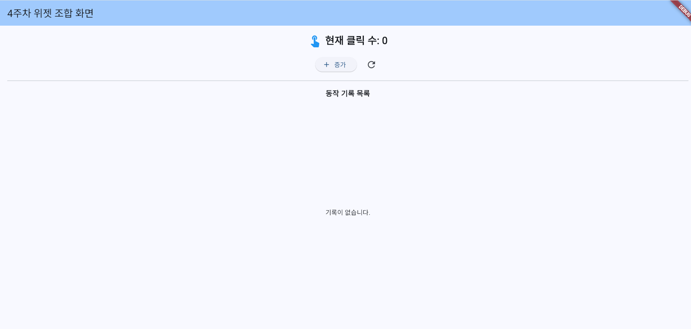
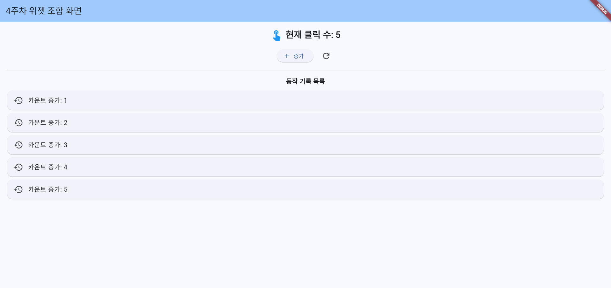
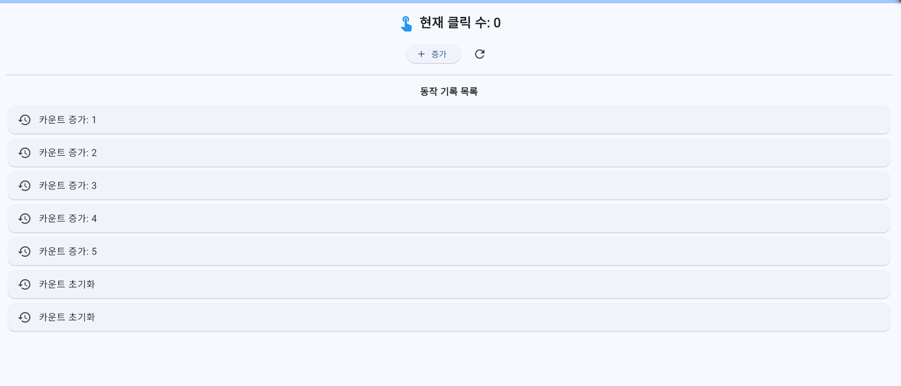

# 4주차 과제: 위젯을 조합한 모바일 화면

## 과제 개요

Flutter 위젯을 조합해 클릭 수를 관리하는 모바일 화면을 구현했습니다. `증가` 버튼을 누르면 클릭 수가 1씩 올라가고 기록 목록에 결과가 추가됩니다. 초기화 버튼은 클릭 수를 0으로 바꾸고 초기화 기록을 남깁니다.

## 화면과 동작

- 상단에 `AppBar` 제목을 표시합니다.
- 현재 클릭 수와 터치 아이콘을 보여 줍니다.
- `증가` 버튼은 카운트와 기록을 갱신합니다.
- 새로고침 아이콘 버튼은 카운트를 0으로 초기화하고 기록을 추가합니다.
- 기록이 없으면 안내 문구를, 기록이 있으면 스크롤 가능한 목록을 표시합니다.

## 위젯 선택표

| 기능 | 위젯 분류 | 선택 위젯 | 선정 이유 |
|---|---|---|---|
| 화면의 기본 틀과 상단 제목 | 화면 구조 | `Scaffold`, `AppBar` | Material 화면의 본문 영역과 상단 앱 바를 구성합니다. |
| 현재 클릭 수 표시 | 보여 주기 | `Text` | 상태 값인 클릭 수를 사용자가 읽을 수 있게 표시합니다. |
| 터치·기록·증가·초기화 아이콘 | 보여 주기/동작 | `Icon`, `IconButton` | 기능을 시각적으로 나타내고 초기화 동작을 아이콘 버튼에 연결합니다. |
| 현재 수와 버튼을 가로로 배치 | 배치 | `Row` | 관련 요소를 한 줄에 배치합니다. |
| 본문 섹션을 세로로 배치 | 배치 | `Column` | 카운트, 버튼, 기록 제목과 목록을 위에서 아래로 배치합니다. |
| 기록 목록 표시 | 배치/스크롤 | `ListView.builder` | 기록 항목을 세로 스크롤 목록으로 만들고 필요할 때 항목을 구성합니다. |
| 카운트 증가 및 기록 추가 | 동작/상태 | `ElevatedButton`, `StatefulWidget`, `setState()` | 사용자 입력에 따라 바뀌는 카운트와 기록을 관리하고 화면을 다시 그립니다. |
| 초기화 및 기록 추가 | 동작/상태 | `IconButton`, `StatefulWidget`, `setState()` | 클릭 수를 초기화하면서 그 결과도 UI에서 확인할 수 있게 합니다. |

## 결정 근거표

| 공식 문서 위치 | 확인한 내용 | 현재 화면에 적용한 이유 |
|---|---|---|
| [Scaffold 클래스](https://api.flutter.dev/flutter/material/Scaffold-class.html) | Material Design 화면의 기본 시각 구조이며 `appBar`, `body` 슬롯을 제공합니다. | 화면의 상단 제목과 본문을 나누는 큰 틀로 사용했습니다. |
| [AppBar 클래스](https://api.flutter.dev/flutter/material/AppBar-class.html) | Material Design 앱 바이며 일반적으로 `Scaffold.appBar`에 배치됩니다. | 화면 제목을 상단에 고정해 표시합니다. |
| [StatefulWidget 클래스](https://api.flutter.dev/flutter/widgets/StatefulWidget-class.html), [setState 메서드](https://api.flutter.dev/flutter/widgets/State/setState.html) | 상태가 변하면 `setState()`로 프레임워크에 변경을 알려 UI를 갱신할 수 있습니다. | 카운트와 로그 목록이 버튼 입력으로 바뀌므로 `StatefulWidget`에 상태를 두고 두 핸들러에서 `setState()`를 호출합니다. |
| [Row 클래스](https://api.flutter.dev/flutter/widgets/Row-class.html) | 자식 위젯을 가로 방향으로 배치합니다. | 카운트와 아이콘, 증가 및 초기화 버튼을 나란히 배치합니다. |
| [Column 클래스](https://api.flutter.dev/flutter/widgets/Column-class.html) | 자식 위젯을 세로 방향으로 배치합니다. | 화면 본문의 여러 영역을 세로로 구성합니다. |
| [ListView 클래스](https://api.flutter.dev/flutter/widgets/ListView-class.html) | 위젯을 선형으로 나열하는 스크롤 가능한 목록입니다. `builder` 생성자는 항목을 필요할 때 구성합니다. | 기록이 여러 개 쌓여도 목록을 스크롤할 수 있도록 `ListView.builder`를 사용합니다. |

## AC1~AC3 실행 결과 및 증빙

아래 결과는 저장소에 제공된 실행 캡처에서 확인한 내용입니다. 과제의 AC별 원문 문구와 별개로, 캡처에 나타난 실제 상태를 기록했습니다.

### AC1 — 초기 상태

앱의 초기 화면에서 클릭 수 `0`과 빈 기록 상태를 확인했습니다.



### AC2 — 증가 동작

증가 버튼을 다섯 번 누른 화면에서 클릭 수 `5`와 `카운트 증가: 1~5` 기록을 확인했습니다.



### AC3 — 초기화 동작

초기화 버튼을 누른 화면에서 클릭 수 `0`으로 변경되고 `카운트 초기화` 기록이 추가된 것을 확인했습니다.



## 요구사항 자체 점검

| 제출 전 확인 항목 | 결과 | 근거 |
|---|---|---|
| `Scaffold`와 `AppBar` 사용 | 확인 | `lib/main.dart`에서 화면 구조에 사용합니다. |
| `Text`, `Icon` 또는 `Image` 중 두 가지 이상 사용 | 확인 | `Text`와 `Icon`을 사용합니다. |
| `Row`, `Column`, `ListView` 중 두 가지 이상으로 배치 | 확인 | 세 위젯을 모두 사용합니다. |
| 버튼을 누르면 화면 결과가 바뀜 | 확인 | 카운트와 기록 목록이 갱신되며 AC 캡처로 확인했습니다. |
| 선택표 항목과 실제 코드 연결 | 확인 | 위 표의 선택 위젯은 `lib/main.dart`의 구현에 대응합니다. |
| 공식 문서 근거 기록 | 확인 | 위젯/API별 Flutter 공식 API 문서를 연결했습니다. |
| `flutter analyze` 오류·경고 없음 | 확인 | 아래 실행 결과 참고 |
| 민감정보 미포함 | 저장소에서 확인 가능한 범위에서 확인 | 코드와 제출 문서에서 비밀번호·토큰 등은 확인되지 않았습니다. 전체 저장소 이력의 모든 정보까지 보증하는 의미는 아닙니다. |

## 정적 분석 결과

실제 프로젝트 루트에서 `flutter analyze`를 실행했습니다.

```text
Analyzing week04_widget_lab...
No issues found! (ran in 6.8s)
```

분석 종료 코드는 `0`입니다. 패키지 해결 단계에서 현재 버전 제약보다 높은 업데이트 가능 버전이 있다는 안내가 있었으나, 분석 결과 오류나 경고는 없었습니다.

## Git 커밋

최종 제출 커밋 ID는 저장소의 최신 커밋으로 확인할 수 있습니다. (`git log -1 --format=%H`)
